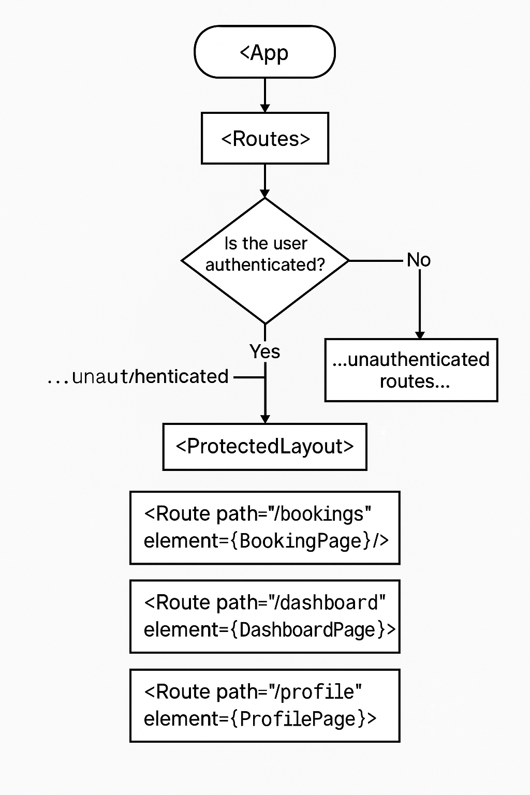
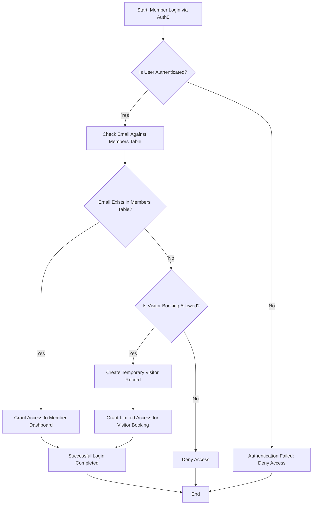
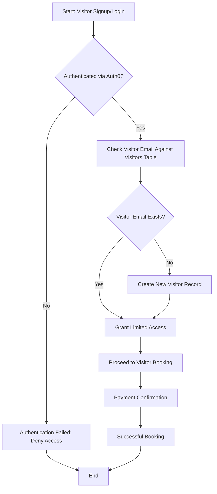
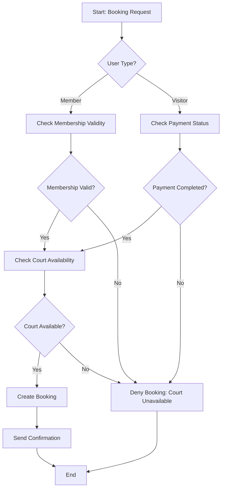
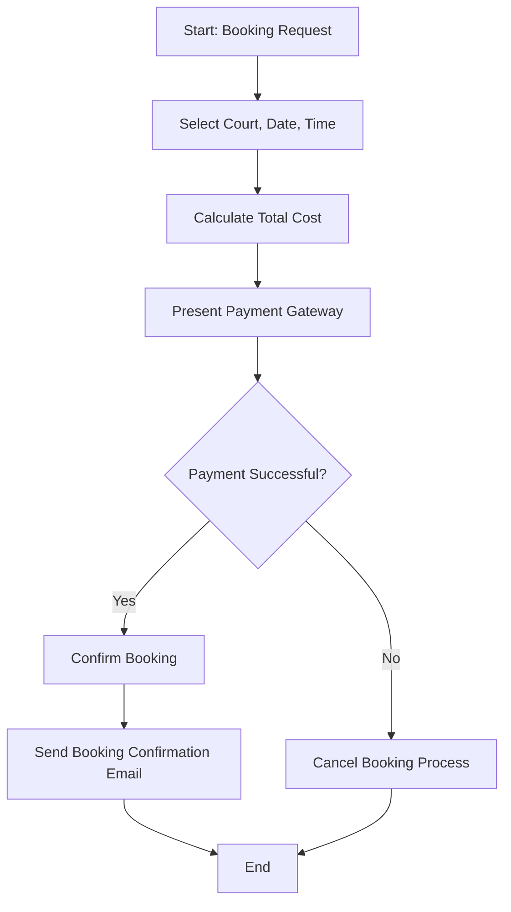

# Tennis Club Court Booking App

Welcome to the **Tennis Club Court Booking App** repository! This application simplifies court bookings for members and is designed with future visitor functionality in mind. The app is a Progressive Web App (PWA) built with React and TypeScript, featuring a secure backend API powered by Express and PostgreSQL.

---

## Table of Contents

- [Tennis Club Court Booking App](#tennis-club-court-booking-app)
  - [Table of Contents](#table-of-contents)
  - [Overview](#overview)
  - [Features](#features)
  - [Tech Stack](#tech-stack)
  - [Setup Instructions](#setup-instructions)
    - [Prerequisites](#prerequisites)
    - [Installation](#installation)
  - [Application Screenshot](#application-screenshot)
    - [A quick diagram showing how the new protected routing flow works now.](#a-quick-diagram-showing-how-the-new-protected-routing-flow-works-now)
  - [Mermaid Diagrams](#mermaid-diagrams)
    - [Member Login and Validation](#member-login-and-validation)
    - [Future Visitor Flow](#future-visitor-flow)
    - [Booking Flow](#booking-flow)
    - [Payment Flow](#payment-flow)
  - [PWA Features](#pwa-features)
  - [Future Enhancements](#future-enhancements)
  - [License](#license)
- [📦 court-booking-pwa](#-court-booking-pwa)
  - [📂 Root](#-root)
  - [🛠️ Backend (`backend/`)](#️-backend-backend)
  - [🎨 Frontend (`frontend/`)](#-frontend-frontend)

---

## Overview
The Tennis Club Court Booking App allows:
- **Members** to securely book courts via their accounts.
- **Admins** to manage members and bookings.
- **Future Visitors** to book courts and pay online.

---

## Features
- Member authentication via **Auth0**.
- CRUD operations for members and bookings.
- Prevention of overlapping bookings.
- Progressive Web App (PWA) capabilities for offline access.
- Admin features for adding and validating member details.
- Database designed for scalability, including future visitor functionality.

---

## Tech Stack
- **Frontend:** React, TypeScript, Vite, React-Bootstrap.
- **Backend:** Node.js, Express, PostgreSQL.
- **Authentication:** Auth0.
- **Deployment:** Docker for PostgreSQL, flexible hosting options.
- **PWA:** Service workers for offline capability and a responsive, mobile-first design.

---

## Setup Instructions

### Prerequisites
- Node.js v18+ and npm.
- PostgreSQL v14+.
- Docker Desktop (for database setup).

### Installation
1. Clone the repository:
   ```bash
   git clone https://github.com/your-repo/tennis-club-booking.git
   cd tennis-club-booking
   ```

2. Install dependencies:
   ```bash
   npm install
   ```

3. Configure environment variables:
   - Copy `.env.example` to `.env`.
   - Add your PostgreSQL, Auth0, and other required credentials.

4. Start the backend server:
   ```bash
   npm run start:server
   ```

5. Start the frontend development server:
   ```bash
   npm run start:client
   ```

6. Access the application at [http://localhost:3000](http://localhost:3000).

---

## Application Screenshot

### A quick diagram showing how the new protected routing flow works now.


---

## Mermaid Diagrams

### Member Login and Validation


### Future Visitor Flow


### Booking Flow


### Payment Flow


---

## PWA Features
- **Offline Mode:** Service workers cache key assets.
- **Installable:** Add to home screen on mobile devices.
- **Responsive Design:** Optimized for desktop, tablet, and mobile.

---

## Future Enhancements
- Enable **visitor bookings** with online payment integration.
- Advanced analytics for court usage.
- Notifications for upcoming bookings.

---

## License
This project is licensed under the MIT License. See the `LICENSE` file for details.

# 📦 court-booking-pwa

## 📂 Root
- 📄 README.md
- 📄 types.ts

## 🛠️ Backend (`backend/`)
- 📄 .env
- 📂 database_config/
  - 🗃️ database.sql
  - ⚙️ pool.ts
- 📂 src/
  - 🚀 app.ts
  - 🚀 server.ts
  - 📂 controllers/
    - 🎯 bookingController.ts
    - 🎯 bookingTypeController.ts
    - 🎯 courtController.ts
    - 🎯 endTimeController.ts
    - 🎯 memberController.ts
    - 🎯 startTimeController.ts
    - 🎯 visitorController.ts
  - 📂 services/
    - 🛎️ booking.service.ts
    - 🛎️ bookingType.service.ts
    - 🛎️ court.service.ts
    - 🛎️ endTime.service.ts
    - 🛎️ member.service.ts
    - 🛎️ startTime.service.ts
    - 🛎️ visitor.service.ts
  - 📂 routes/
    - 🛣️ booking.routes.ts
    - 🛣️ bookingType.routes.ts
    - 🛣️ court.routes.ts
    - 🛣️ endTime.routes.ts
    - 🛣️ member.routes.ts
    - 🛣️ startTime.routes.ts
    - 🛣️ visitor.routes.ts
  - 📂 middlewares/
    - 🛡️ errorHandler.ts
  - 📂 database/
    - ⚙️ pool.ts
  - 📂 utils/ (empty for now)
- 📄 package.json
- 📄 package-lock.json
- 📄 tsconfig.json

## 🎨 Frontend (`frontend/`)
- 📄 .env
- 📄 .eslintrc.cjs
- 📂 .netlify/
  - 📂 functions-internal/
  - 📂 v1/functions/
- 📂 dist/ (built PWA output)
  - 📸 assets/
  - 🖼️ icons, manifest, sw.js
- 📂 public/
  - 🖼️ favicon.svg
- 📂 src/
  - 🚀 main.tsx
  - 🎨 App.tsx + App.css
  - 🎨 PWABadge.tsx + PWABadge.css
  - 📂 assets/
    - 🖼️ Images (sample.png, protected-routing-flow.png)
  - 📂 authentication/
    - 🔒 Auth0ProviderWithRedirect.tsx
  - 📂 components/
    - 📃 BookingCard.tsx
    - 📃 PageFooter.tsx
    - 📃 PageLayout.tsx
    - 📃 PageLoader.tsx
    - 📃 ProtectedLayout.tsx
    - 📂 buttons/
      - 🔘 LoginButton.tsx
      - 🔘 LogoutButton.tsx
      - 🔘 SignupButton.tsx
    - 📂 navigation/
      - 🧭 AdminBookingsTable.tsx
      - 🧭 Navbar.tsx
      - 🧭 NavbarButtons.tsx
      - 🧭 NavbarTab.tsx
      - 🧭 NavbarTabs.tsx
      - 🧭 TestTabs.tsx
  - 📂 customHooks/
    - 🪝 AuthProvider.ts
    - 🪝 useBookingTypes.ts
    - 🪝 useBookings.ts
    - 🪝 useCreateBooking.ts
    - 🪝 useDeleteBooking.ts
    - 🪝 useFetchBooking.ts
    - 🪝 useFetchMemberId.ts
    - 🪝 useCourts.ts
    - 🪝 useStartTimes.ts
    - 🪝 useEndTimes.ts
    - 🪝 useUpdateBooking.ts
  - 📂 pages/
    - 📄 AboutSection.tsx
    - 📄 AdminPage.tsx
    - 📄 BookingEditPage.tsx
    - 📄 BookingForm.tsx
    - 📄 BookingList.tsx
    - 📄 BookingPage.tsx
    - 📄 BookingTypesPage.tsx
    - 📄 CourtsPage.tsx
    - 📄 DashboardPage.tsx
    - 📄 DatePickerPage.tsx
    - 📄 FacilitiesSection.tsx
    - 📄 HeroBanner.tsx
    - 📄 HomePage.tsx
    - 📄 LandingPage.tsx
    - 📄 MembershipSection.tsx
    - 📄 NotFoundPage.tsx
    - 📄 ProfilePage.tsx
    - 📄 SignUpPage.tsx
    - 📄 TimeSelector.tsx
    - 📄 Unauthorized.tsx
  - 📂 services/ (empty or future API calls)
  - 📂 styles/
    - 🎨 base.css
    - 🎨 bookings.css
    - 🎨 buttons.css
    - 🎨 hero-banner.css
    - 🎨 index.css
    - 🎨 navbar.css
    - 🎨 responsive.css
    - 🎨 sections.css
- 📄 package.json
- 📄 package-lock.json
- 📄 vite.config.ts
- 📄 tsconfig.json
- 📄 tsconfig.node.json

