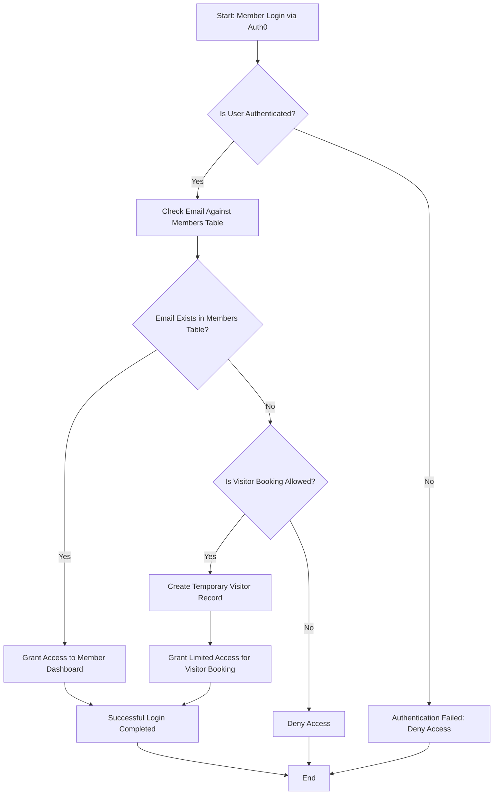
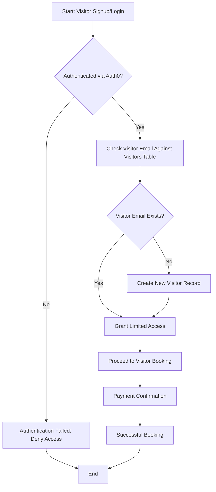
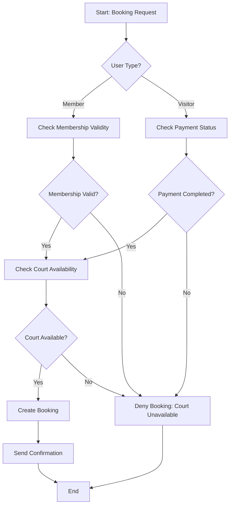
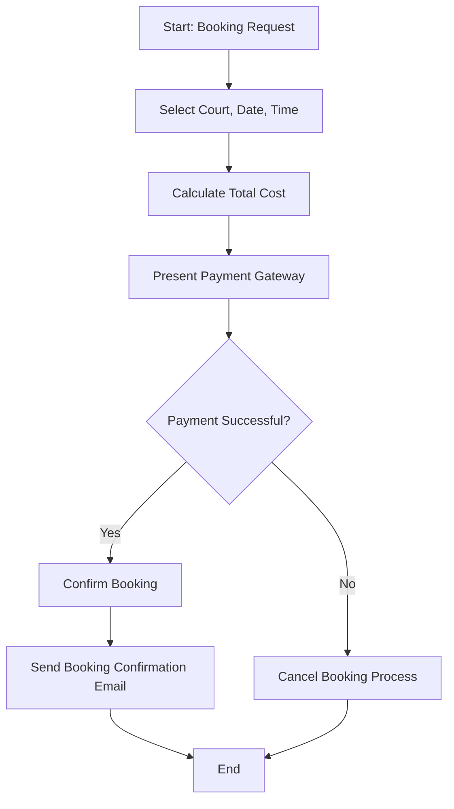

# Tennis Club Court Booking App

Welcome to the **Tennis Club Court Booking App** repository! This application simplifies court bookings for members and is designed with future visitor functionality in mind. The app is a Progressive Web App (PWA) built with React and TypeScript, featuring a secure backend API powered by Express and PostgreSQL.

---

## Table of Contents

1. [Overview](#overview)
2. [Features](#features)
3. [Tech Stack](#tech-stack)
4. [Setup Instructions](#setup-instructions)
    - [Prerequisites](#prerequisites)
    - [Installation](#installation)
5. [Database Schema](#database-schema)
6. [API Endpoints](#api-endpoints)
    - [Admin Endpoints](#admin-endpoints)
    - [Booking Endpoints](#booking-endpoints)
7. [Mermaid Diagrams](#mermaid-diagrams)
    - [Member Login and Validation](#member-login-and-validation)
    - [Future Visitor Flow](#future-visitor-flow)
    - [Booking Flow](#booking-flow)
    - [Payment Flow](#payment-flow)
8. [PWA Features](#pwa-features)
9. [Future Enhancements](#future-enhancements)
10. [License](#license)

---

## Overview
The Tennis Club Court Booking App allows:
- **Members** to securely book courts via their accounts.
- **Admins** to manage members and bookings.
- **Future Visitors** to book courts and pay online.

---

## Features
- Member authentication via **Auth0**.
- CRUD operations for members and bookings.
- Prevention of overlapping bookings.
- Progressive Web App (PWA) capabilities for offline access.
- Admin features for adding and validating member details.
- Database designed for scalability, including future visitor functionality.

---

## Tech Stack
- **Frontend:** React, TypeScript, Vite, React-Bootstrap.
- **Backend:** Node.js, Express, PostgreSQL.
- **Authentication:** Auth0.
- **Deployment:** Docker for PostgreSQL, flexible hosting options.
- **PWA:** Service workers for offline capability and a responsive, mobile-first design.

---

## Setup Instructions

### Prerequisites
- Node.js v18+ and npm.
- PostgreSQL v14+.
- Docker Desktop (for database setup).

### Installation
1. Clone the repository:
   ```bash
   git clone https://github.com/your-repo/tennis-club-booking.git
   cd tennis-club-booking
   ```

2. Install dependencies:
   ```bash
   npm install
   ```

3. Configure environment variables:
   - Copy `.env.example` to `.env`.
   - Add your PostgreSQL, Auth0, and other required credentials.

4. Start the backend server:
   ```bash
   npm run start:server
   ```

5. Start the frontend development server:
   ```bash
   npm run start:client
   ```

6. Access the application at [http://localhost:3000](http://localhost:3000).

---

## Database Schema

### Members Table
```sql
CREATE TABLE members (
    member_id SERIAL PRIMARY KEY,
    first_name VARCHAR(50) NOT NULL,
    last_name VARCHAR(50) NOT NULL,
    email VARCHAR(100) UNIQUE NOT NULL,
    phone_number VARCHAR(20),
    membership_valid_until DATE
);
```

### Visitors Table (Future Use)
```sql
CREATE TABLE visitors (
    visitor_id SERIAL PRIMARY KEY,
    first_name VARCHAR(50) NOT NULL,
    last_name VARCHAR(50) NOT NULL,
    email VARCHAR(100),
    phone_number VARCHAR(20),
    created_at TIMESTAMP DEFAULT NOW()
);
```

### Bookings Table
```sql
CREATE TABLE bookings (
    booking_id SERIAL PRIMARY KEY,
    user_type VARCHAR(10) NOT NULL CHECK (user_type IN ('member', 'visitor')),
    user_id INT NOT NULL,
    court_id INT NOT NULL REFERENCES courts(court_id) ON DELETE CASCADE,
    booking_date DATE NOT NULL,
    start_time TIME NOT NULL,
    end_time TIME NOT NULL,
    created_at TIMESTAMP DEFAULT NOW()
);
```

---

## API Endpoints

### Admin Endpoints
- **Add Member:**
  ```http
  POST /api/admin/add-member
  ```
  **Payload:**
  ```json
  {
    "first_name": "John",
    "last_name": "Doe",
    "email": "john.doe@example.com",
    "phone_number": "+27 12 345 6789",
    "membership_valid_until": "2024-12-31"
  }
  ```

### Booking Endpoints
- **Create Booking:**
  ```http
  POST /api/bookings
  ```
  **Payload:**
  ```json
  {
    "user_type": "member",
    "user_id": 1,
    "court_id": 2,
    "booking_date": "2024-12-12",
    "start_time": "10:00",
    "end_time": "11:00"
  }
  ```

---

## Mermaid Diagrams

### Member Login and Validation


### Future Visitor Flow


### Booking Flow


### Payment Flow


---

## PWA Features
- **Offline Mode:** Service workers cache key assets.
- **Installable:** Add to home screen on mobile devices.
- **Responsive Design:** Optimized for desktop, tablet, and mobile.

---

## Future Enhancements
- Enable **visitor bookings** with online payment integration.
- Advanced analytics for court usage.
- Notifications for upcoming bookings.

---

## License
This project is licensed under the MIT License. See the `LICENSE` file for details.
